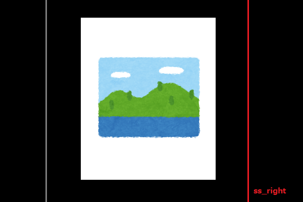

ssff
====


[](LICENSE)

[English page](./README.md)  

## 概要
スクリーンショットとページ送りを行う Windows 専用のツール。  
例 ) PDF, EPUB などのファイルを画像ファイルに変換する。  

### 主な機能
- スクリーンショットとページ送りの繰り返し実行
- (オプション) トリミングサイズの自動認識
- (オプション) 自動終了
- (オプション) 画像の垂直分割
- (オプション) Zip 圧縮

## 要件
- Python3.10
    - PyAutoGui
    - PIL
    - pywin32

## 使用方法
1. `setting.json` を用意する。
2. `ssff.exe` または `python3 ssff.py` を実行する。
3. コンソール上で不足しているパラメータを入力する。
4. 終了するまで PC を触らずに待つ。

# オプション
オプションの値は設定ファイルで事前に準備することができる。 (`setting.json`).  
設定ファイルで与えられなかった値はコンソールで入力する。  

## setting.json
`setting.json` というファイル名でカレントディレクトリに用意する。    
UTF-8 エンコードの JSON 形式のファイルとする。  

サンプル :  

```json
{
    "wait_before_start_ms": 5000,
    "interval_ms": 750,
    "output_dir_prefix": "output_",
    "fname_prefix": "page_",
    "trim": "fit-onetime"
}
```

## `start_file_no`
ファイル番号の開始値。 (整数)  

## `page_num`
ページ数または "auto"。（整数または文字列）  

この値はプログラムの終了条件となる。  
"auto" にすると、連続した同じページを見つけたときに自動的に終了する。  

## `page_direction`
ページ方向。（文字列）  

"right" ("r") または "left" ("l") 。  

## `wait_before_start_ms`
実行開始する前の待機時間 (ms) 。（整数）

## `interval_ms`
実行間隔 (ms) 。（整数）  

## `output_dir_prefix`
出力ディレクトリの接頭辞。（文字列）   

ディレクトリはカレントディレクトリに作られる。  

## `fname_prefix`
画像ファイル名の接頭辞。（文字列）  

画像ファイル名は接頭辞 + 連番となる。  

## `ss_left`, `ss_right`, `ss_top`, `ss_bottom`
スクリーンショット範囲の座標値、または "max" 。（整数または文字列）  

"max" にすると、ディスプレイサイズが使用される。  





## `trim`
トリミング位置。（文字列）  

### "none" または "n".
トリミングを行わない。  

### "fit" or "f".
全てのページにスクリーンショットから、自動的に余白部分（同じ色が連続した部分）を除去する。  


### "fit-onetime" or "o".
全てのページにスクリーンショットから、自動的に余白部分（同じ色が連続した部分）を除去する。先頭のページ（表紙）で算出されたトリミングサイズが全てのページに使用される。  

## `vsplit`
画像が横長の場合に垂直分割する。（文字列）  

"yes" または "no" で実行可否を指定する。  

## `target_window`
対象とするウィンドウのタイトル。（文字列）  

この値を設定すると、指定された文字列をタイトルに持つウィンドウを自動的に最前面化する。  
部分文字列でも可。  

## `dir_name`
出力ディレクトリ名。（文字列）  

全ての処理が終了した後でディレクトリをリネームする。名称が設定されていなければリネームしない。  

## `to_zip`
全ての処理が終了した後でディレクトリを zip 圧縮する。  

"yes" または "no" で実行可否を指定する。  
