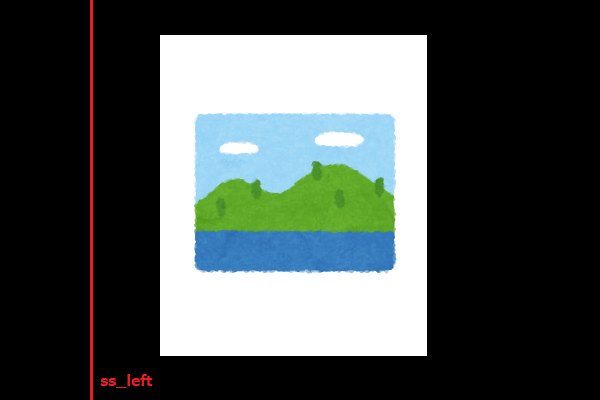
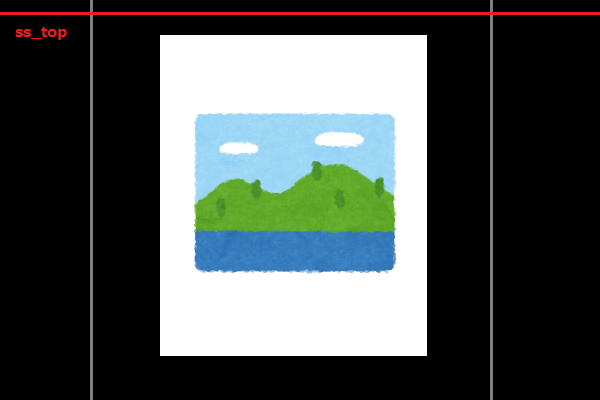
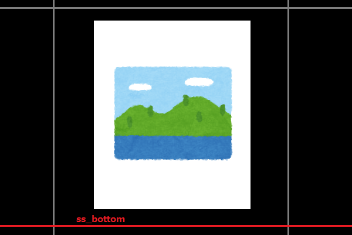
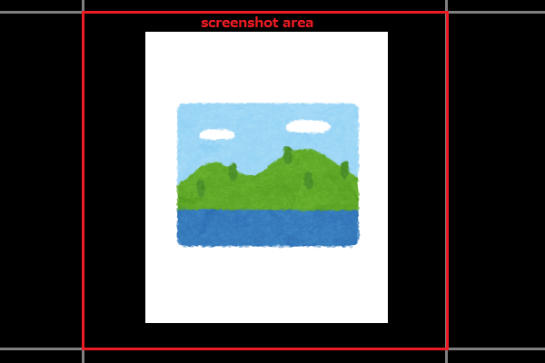
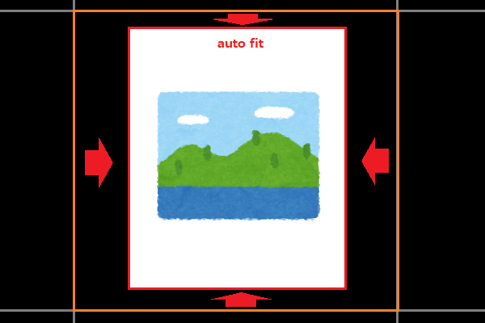

ffss
====


[](LICENSE)

## Overview
form feed and screenshot. For Windows OS.  
e.g.) PDF, EPUB file to image files.

## Requirements
- Python3.10
    - PyAutoGui
    - PIL
    - pywin32

## Usage
1. Prepare `setting.json`.
2. Run `ffss.exe` or `python3 ffss.py`.
3. Input missing settings on console.
4. Do not touch your PC, until completed...

# Settings
Setting values can be prepared in advance in a configuration file (`setting.json`).  
If value is not present in the configuration file, you will be prompted to enter it.  

## setting.json
To be placed in the current directory with the name `setting.json`.  
File format is JSON, encoding is UTF-8.  

Sample:  

```json
{
    "wait_before_start_ms": 5000,
    "interval_ms": 750,
    "output_dir_prefix": "output_",
    "fname_prefix": "page_",
    "trim": "fit-onetime"
}
```


## `page_num`
Number of pages, or "auto". (Integer or String)  

It is a condition of program termination.  
If set to "auto", the program will automatically terminate if the same page is found.

## `page_direction`
Page direction. (String)  

Either "right" ("r") or "left" ("l").  

## `wait_before_start_ms`
Wait before start (ms). (Integer)  

## `interval_ms`
Interval (ms). (Integer)  

## `output_dir_prefix`
Output directory prefix. (String)  

Output directory is created in the current directory.  

## `fname_prefix`
File name prefix. (String)

Image files are named with a prefix + sequential number.  

## `ss_left`, `ss_right`, `ss_top`, `ss_bottom`
Position of screenshot area, or "max". (Integer or String)  

If set to "max", each end of the display size is used.







## `trim`
Trim position. (String)  

### If set to "none" or "n".
No trimming.  

### If set to "fit" or "f".
Automatically removes marginal areas (areas of the same continuous color) in screenshot images on all pages.



### If set to "fit-onetime" or "o".
Automatically removes marginal areas (areas of the same continuous color) in screenshot images. The trim size calculated for the first page (front cover) is used for all pages.  

## `target_window`
Target window title. (String)  

If input this value, window with the specified string caption are automatically foreground.  
Allow substring.  

## TODO
- [x] Auto fit trim size.
- [x] Auto end decision.
- [ ] Split page vertical.
- [ ] To executable file. (Use PyInstaller)
